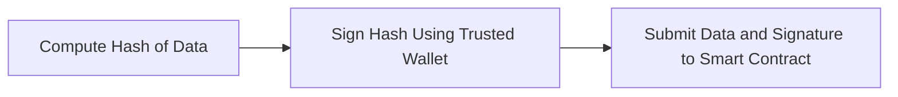
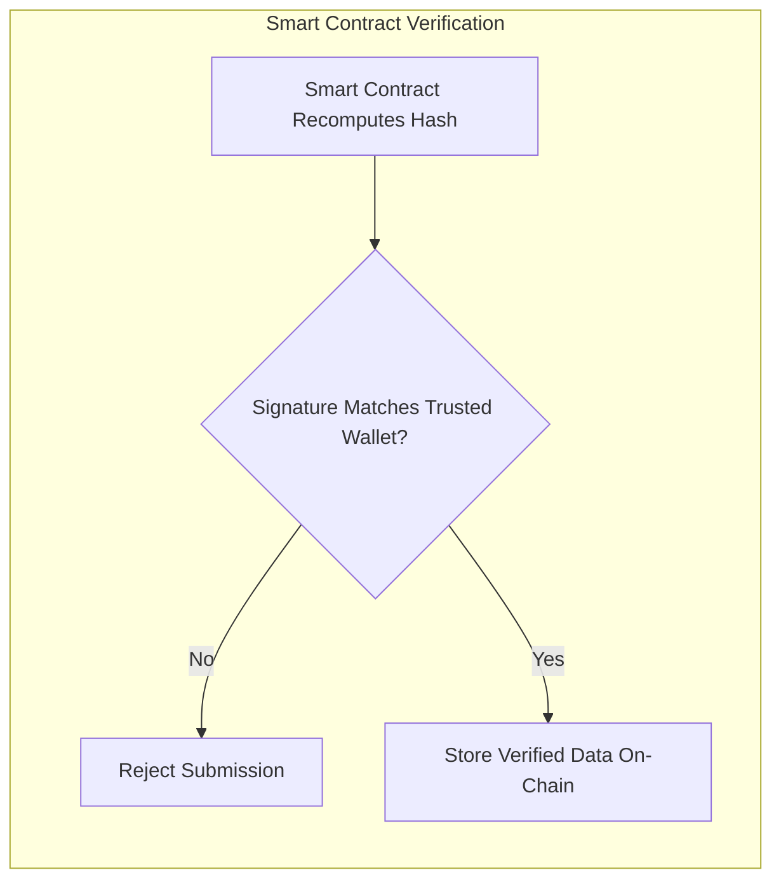
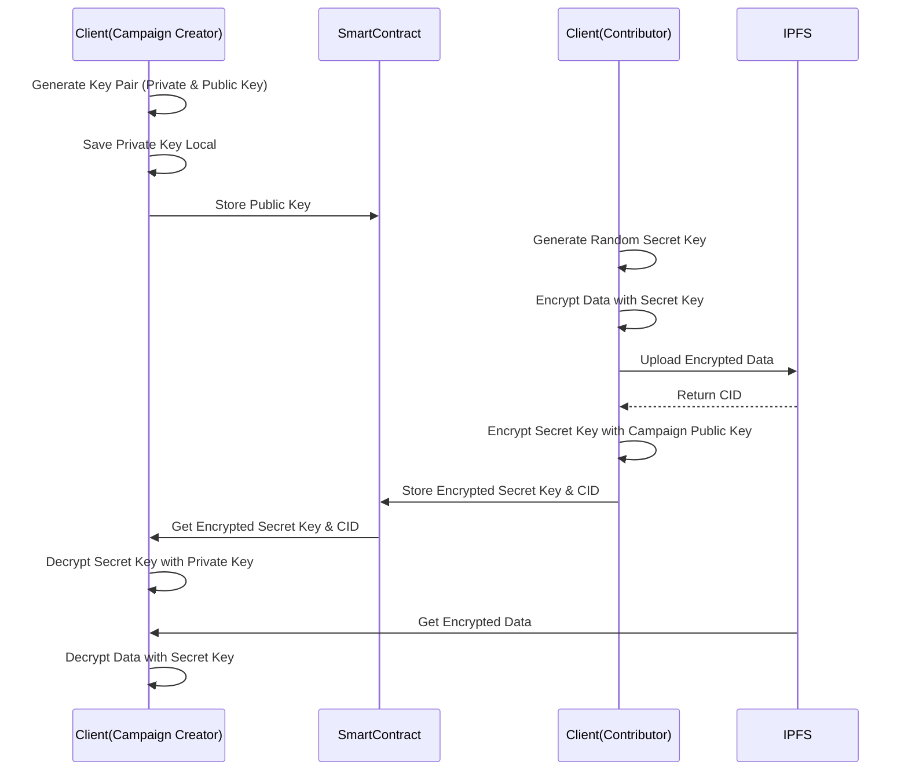

**Datagora** is a decentralized platform where users can contribute their data to relevant campaigns in exchange for rewards. An AI system evaluates the submitted data based on campaign criteria and assigns a quality score. If the data meets the minimum score, contributors receive a share of the campaign's locked pool, distributed dynamically based on data count and score. The data is **encrypted** and stored on IPFS, ensuring **only the campaign creator** can access it securely.


## Features  

- 🔐 **Bulletproof Security** – Our data marketplace ensures secure storage and access through multi-layered encryption, protecting sensitive data with asymmetric encryption and IPFS storage.  
- 🤖 **Premium Quality** – Advanced AI models analyze submissions to guarantee top-tier, campaign-tailored data every time.  
- ⚡ **Lightning Speed** – Built on Movement, our platform delivers ultra-fast transactions—up to 160,000 TPS—for unmatched performance.  
- 📊 **Instant Rewards** – Rewards are dynamically allocated based on data quality, ensuring fair distribution and preventing low-value contributions from diluting the reward pool.  
- 🛠 **Bespoke Data** – Campaign creators define precise criteria to receive customized, high-quality data tailored to their needs.  
- 🏛 **Fortified Contracts** – Our **Move-based** smart contracts deliver robust, secure, and reliable automation for seamless operations.  


## Techstack  

- **Frontend** – Developed using **Next.js**, ensuring a fast and responsive user experience, and deployed on **Vercel** for scalability and reliability.  
- **Backend** – Built with **Next.js**, handling business logic, API interactions, and AI verification processes to support seamless data transactions.  
- **Smart Contracts** – Written in **Move**, leveraging its security and efficiency, and deployed on **Movement** for decentralized and transparent execution.  
- **AI Verification** – Using **Google Gemini 2.0** for testing, with different models planned for freemium and premium users in production.  

## Frontend  

- 🌐 **User Dashboard** – Provides an intuitive interface for campaign creators and contributors to manage campaigns, track contributions, and view rewards.  
- 🔑 **Encryption Handling** – Performs offline key generation and encryption before sending data to the backend, ensuring end-to-end security.  
- 📊 **Real-time Analytics** – Displays contribution stats, campaign progress, and AI verification results dynamically.  
- [How to start repository of frontend](#how-to-start-repository-of-frontend)

## Backend  

- ⚡ **API Layer** – Handles interactions between the frontend, AI verification system, and smart contracts, ensuring smooth data flow.  
- 🔐 **Encryption Processing** – Manages the secure encryption and decryption of contribution data before storage and retrieval.  
- 🏦 **Reward Distribution Engine** – Calculates rewards based on AI-assigned quality scores and executes automated payouts via smart contracts.  

## Smart Contracts  

- 🏗 **CampaignManager** – Handles the creation and management of campaigns, allowing campaign creators to set parameters and manage them.  
- 📥 **ContributionManager** – Manages user data contributions, ensuring they are linked to the appropriate campaigns.  
- 💰 **EscrowManager** – Holds the locked reward pools for campaigns. When a contributor's data meets the required criteria, their share is released from this pool.  
- ✅ **Verifier** – Ensures the authenticity of AI-generated quality scores. The backend AI signs the scores using a trusted wallet, and this contract verifies whether the signature originates from the trusted source. 
- [How to start repository of smart contracts](#how-to-start-repository-of-smart-contracts)
  

## AI Verification

Before a contribution is accepted, an AI-powered verification system evaluates whether the submitted data meets the campaign's requirements. This process ensures data quality and integrity. The verification follows these steps:

1. **Campaign Requirement Definition**  
   - When a campaign is created, the **required data attributes** are specified (e.g., invoice details, required fields, format).  
   - These requirements are stored **on-chain** within the smart contract.  

2. **Contribution Validation**  
   - When a user submits data, it is first processed by an **AI model**.  
   - The AI checks if the data **matches** the campaign requirements.  
   - It also analyzes **data authenticity** to detect AI-generated or low-quality submissions.  

3. **Scoring & Count Calculation**  
   - If the data meets the requirements, a **quality score** is assigned based on multiple factors like completeness, authenticity, and relevance.  
   - The system also tracks the **total number of valid contributions** for the campaign.  
   - The **score** and **data count** are returned to the client, which can be used for reward distribution or filtering.  

This mechanism ensures that only **high-quality** and **relevant** data is accepted while preventing spam or low-value contributions.

## Trusted Wallet Verification






To ensure the authenticity of AI-verified contributions, **trusted wallets** are used to sign and validate data before submission to the smart contract. This prevents tampering and guarantees that only AI-verified data is accepted.

### 1. AI Verification & Hashing  
   - The AI processes the submitted data and computes a **score** and **data count** based on the campaign requirements.  
   - These values, along with the raw data, are **hashed** by the backend using a **trusted wallet**.  
   - The **hash is cryptographically signed** using the trusted wallet's private key.  

### 2. Smart Contract Validation  
   - When submitting a contribution, the contributor includes the **score**, **data count**, and the **signature** generated by the trusted wallet.  
   - The smart contract **recomputes the hash** from the submitted values.  
   - It then verifies the **signature** against the **trusted wallet's public key**.  

### 3. Ensuring Data Integrity  
   - If the signature matches, the contribution is considered **legitimate** and stored on-chain.  
   - If the signature fails validation, the submission is **rejected**, preventing unauthorized or manipulated data from being stored.  

This **verification mechanism** ensures that all contributions undergo **genuine AI verification** and prevents any bypassing of the validation process.


## Encryption Algorithmes



In DataGora, encryption ensures that contributors' data remains secure and can only be decrypted by the campaign creator. The encryption process follows these steps:

1. **Campaign Creation**  
   - The frontend generates an **offline asymmetric key pair** (public and private key).  
   - The **public key** is stored on the blockchain along with campaign details.  
   - The **private key** is saved by the campaign creator and is not stored anywhere.

2. **Contributor Data Encryption & Submission**  
   - The contributor's frontend generates a **random symmetric secret key**.  
   - The data is **symmetrically encrypted** using this secret key.  
   - The encrypted data is uploaded to **IPFS**, and its **CID** is stored.  
   - The **secret key** is then **asymmetrically encrypted** using the campaign’s public key.  
   - The encrypted secret key and IPFS CID are sent to the smart contract as a **contribution**.

3. **Campaign Creator Data Decryption**  
   - The creator retrieves the encrypted **secret key** from the smart contract.  
   - The private key (stored by the creator) is used to **decrypt** the secret key.  
   - The decrypted secret key is used to **decrypt** the data fetched from IPFS.  

This mechanism ensures that only the campaign creator, who possesses the private key, can decrypt the contributed data while keeping it fully encrypted and inaccessible to anyone else.

## REPOSITORY GUIDES

### How to start repository of Smart Contracts

1. Install dependencies: `npm install`

2. Install Movement CLI: [Official Movement CLI Setup Guide](https://docs.movementnetwork.xyz/devs/movementcli)

3. Initialize movement account in two separate module folder.

  

- sources/data: `movement init --skip-faucet`

- sources/marketplace: `movement init --skip-faucet`

- for both, you will do the same process:

  

- select network as "custom" and then press enter.

- after that, movement cli will request rest url, write the url which you want to use.

we recommend using bardock testnet for testing. `https://aptos.testnet.bardock.movementlabs.xyz/v1`

- then you will get private key, public key, account address in both .movement folder, please rename network from "Custom" to "Testnet".

  

***

  

on sources/data:

  

- Use `movement move init --name Data` command to initialize the project.

- In Move.toml file, add the following to the [addresses] section:

  

```toml

[addresses]

data = "account_address_in_the_.movement_folder"

```

  

on sources/marketplace:

  

- Use `movement move init --name Marketplace` command to initialize the project.

- In Move.toml file, add the following to the [addresses] and [dependencies] section:

  

```toml

[addresses]

marketplace = "account_address_in_the_.movement_folder"

  

[dependencies]

AptosFramework = { git = "https://github.com/aptos-labs/aptos-core.git", rev = "mainnet", subdir = "aptos-move/framework/aptos-framework"}

Data = {local = "../data"}

```

  

Afterall your folders in sources, should look like this:

  


  

4. Create .env file using .env.example file:

  

- In that file you should fill it like this.

  

```env

NODE_URL=https://aptos.testnet.bardock.movementlabs.xyz/v1

FAUCET_URL=https://fund.testnet.bardock.movementlabs.xyz/

  

ACCOUNT_PRIVATE_KEY=(your_any_movement_account_private_key)

  

MODULE_PRIVATE_KEY=(marketplace_module_private_key)

MODULE_ADDRESS=(marketplace_module_address)

  

TOKEN_MODULE_PRIVATE_KEY=(token_module_private_key)

TOKEN_MODULE_ADDRESS=(token_module_address)

  

TEST=(choose true or false)

```

  

5. Use `npm start` to interact with the modules or deploy it to the network.

-If it works properly, you should see the following output:

  


  

6. You can use publish command to publish the module to the network.

  

- We need $MOVE for both DATA and MARKETPLACE module addresses.

- To cover this, we recommend to use "https://faucet.movementnetwork.xyz/?network=bardock"

- Before publishing the modules you must publish the DATA module first.

- Then, you can publish the MARKETPLACE module. Because the MARKETPLACE module belongs to DATA module and its address.

  

#### Additional Notes - Smart Contracts:

  

- Marketplace module is using $DATA as its native token. So you need to have some $DATA in your account to interact with the module.

- You can have $DATA from the $DATA faucet.

- You must have add the "trusted public key" before initializing the create campaign function. It can be any secure account that YOU only have the access to it. We recommend using the marketplace module account for this.

## How to start repository of Frontend

1. Clone the repository.

  

```bash

git  clone  https://github.com/itublockchain/datagora-front.git  <local-folder-name>

```

  

2. Install dependencies.

  

```bash

npm  install

```

  

3. Set the environment variables.

  

- Create a `.env` file in the root of the project.

- Copy the variables from `.env.example` to `.env` and set them according to your needs.

  

### [Development]

  

If you want to run the project in development mode, you can use the following command:

  

4. Run the project in development mode.

  

```bash

npm  run  dev

```

  

### [Production]

  

If you want to build the project, you can use the following command:

  

4. Build the project.

  

```bash

npm  run  build

```

  

5. Run the project.

```bash

npm  run  start

```

### Additional Notes Frontend:

  

- You can use [example contribution data](https://ipfs.io/ipfs/bafkreieh5ki5tqtf62pnxfm3fjaf25j3nl3rhukru4plukpn3o6kbkhpjm) for testing projects.
